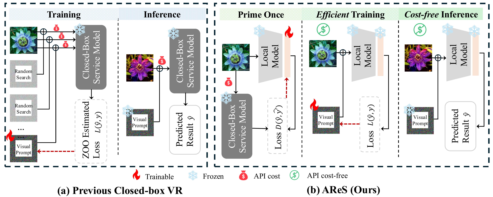
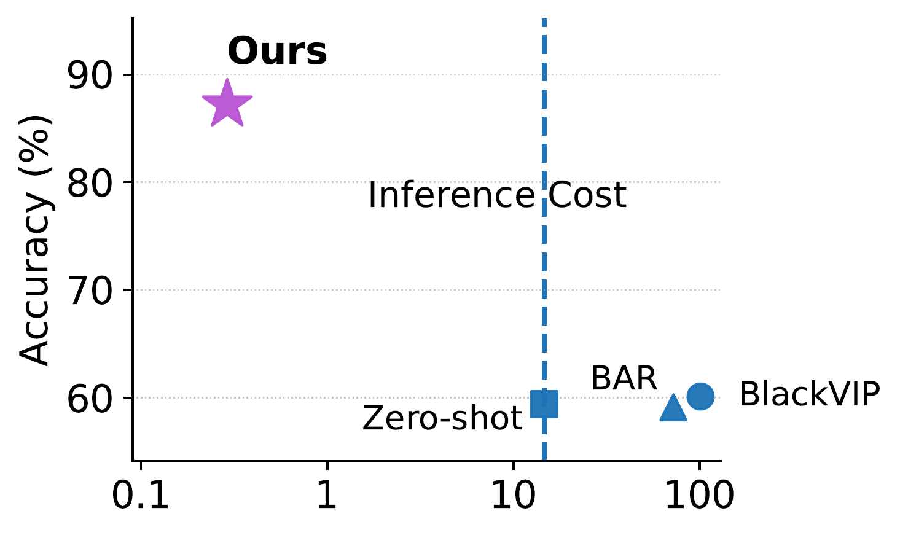
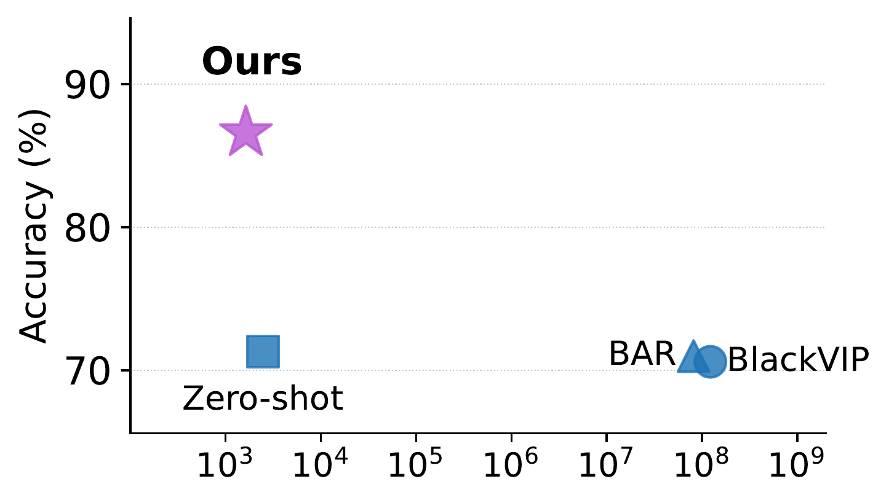
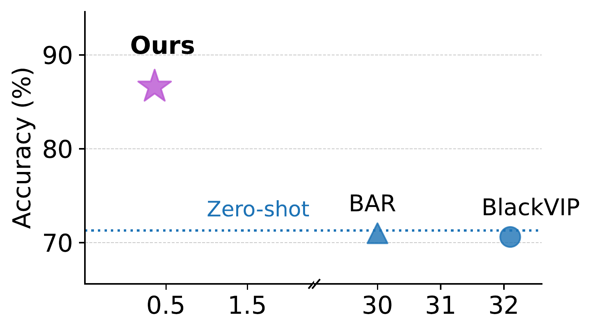

# Prime Once, then Reprogram Locally: An Efficient Alternative to Black-Box Service Model Adaptation

### CVPR 2026 Highlight

<p align="center">
  <a href="https://arxiv.org/abs/2604.01474"></a>
  <a href="#"></a>
  <a href="https://github.com/yunbeizhang/AReS/blob/main/LICENSE"></a>
</p>

<p align="center">
  <strong>Yunbei Zhang<sup>1</sup></strong> &emsp;
  <strong>Chengyi Cai<sup>2</sup></strong> &emsp;
  <strong>Feng Liu<sup>2</sup></strong> &emsp;
  <strong>Jihun Hamm<sup>1</sup></strong>
</p>
<p align="center">
  <sup>1</sup>Tulane University &emsp; <sup>2</sup>University of Melbourne
</p>

<p align="center">
  <a href="https://arxiv.org/abs/2604.01474"><strong>[Paper]</strong></a>
</p>

---

## News

- **Apr 10, 2026** &mdash; Code released.
- **Apr 08, 2026** &mdash; Selected as **CVPR 2026 Highlight**!
- **Apr 03, 2026** &mdash; Title changed to *"Prime Once, then Reprogram Locally: An Efficient Alternative to Black-Box Service Model Adaptation"*.
- **Feb 20, 2026** &mdash; Accepted to CVPR 2026.

---

## Overview

**AReS** (Alternative efficient Reprogramming for Service models) proposes an alternative to the conventional zeroth-order optimization (ZOO) paradigm for adapting closed-box service models (APIs) to downstream tasks. Instead of costly, continuous API queries, AReS performs a **single-pass interaction** with the service API to prime a local pre-trained encoder, then conducts all subsequent adaptation and inference **entirely locally** &mdash; eliminating further API costs.

<p align="center">
  
</p>

**(a)** Previous closed-box methods use ZOO, requiring numerous API calls during training and one per image at inference. **(b)** AReS performs a one-time priming to prepare a local model, enabling efficient glass-box reprogramming with no further API dependency.

## Highlights

- **Effective on modern APIs:** On GPT-4o, AReS achieves **+27.8%** over zero-shot, where ZOO-based methods provide little to no improvement.
- **State-of-the-art accuracy:** Outperforms prior methods by **+2.5%** (VLMs) and **+15.6%** (VMs) on average across 10 datasets.
- **99.99% fewer API calls:** Reduces API calls from ~10<sup>8</sup> to ~10<sup>3</sup>, and training time from 32+ hours to under 30 minutes.
- **Cost-free inference:** Once primed, all inference runs locally with zero API cost.

<p align="center">
  
  
  
</p>

**(a)** On GPT-4o, ZOO-based methods show limited effectiveness while incurring high costs. **(b, c)** On CLIP ViT-B/16 (Flowers102), AReS uses only ~10<sup>3</sup> API calls and 0.4 hours vs. ~10<sup>8</sup> calls and 32+ hours for prior methods.

---

## Installation

```bash
git clone https://github.com/yunbeizhang/AReS.git
cd AReS
conda create -n AReS python=3.10 -y
conda activate AReS
pip install -r requirements.txt
```

## Data Preparation

We evaluate on ten diverse datasets: Flowers102, StanfordCars, DTD, UCF101, Food101, GTSRB, EuroSAT, OxfordPets, SUN397, and SVHN. Please download the datasets provided by [OPTML-Group/ILM-VP](https://github.com/OPTML-Group/ILM-VP), and modify `data_path` in `src/cfg.py` to point to your data directory.

## Quick Start: Flowers102 Example

Run the full AReS pipeline (VLM setting) on Flowers102 with a single command:

```bash
bash scripts/run_example_flowers.sh
```

This runs both stages:

**Stage 1 &mdash; Prime Once:** Query CLIP ViT-B/16 once per training image, train a lightweight linear layer on the local ViT-B/16 encoder.

```bash
python src/prime_vlm.py \
    --dataset flowers102 \
    --student vitb16 \
    --mode linear \
    --criterion kl \
    --lr 1e-3 \
    --epochs 100 \
    --num_samples_per_class 16 \
    --seed 0
```

**Stage 2 &mdash; Reprogram Locally:** Train a visual prompt on the primed local model using glass-box optimization.

```bash
python src/reprogram.py \
    --dataset flowers102 \
    --model vitb16 \
    --reprogramming padding \
    --mapping blmp \
    --vlm_distilled \
    --student vitb16 \
    --mode linear \
    --criterion kl \
    --num_samples_per_class 16 \
    --seed 0
```


## Acknowledgements

Our visual reprogramming (VR) and label mapping components build upon the [BayesianLM](https://github.com/tmlr-group/BayesianLM) codebase. We use the datasets provided by [OPTML-Group/ILM-VP](https://github.com/OPTML-Group/ILM-VP). We thank the authors for making their code and data publicly available.

## Citation

If you find this work useful, please cite our paper:

```bibtex
@inproceedings{zhang2026prime,
  title={Prime Once, then Reprogram Locally: An Efficient Alternative to Black-Box Service Model Adaptation},
  author={Zhang, Yunbei and Cai, Chengyi and Liu, Feng and Hamm, Jihun},
  booktitle={Proceedings of the IEEE/CVF Conference on Computer Vision and Pattern Recognition (CVPR)},
  year={2026}
}
```

## License

This project is licensed under the [Apache License 2.0](LICENSE).
